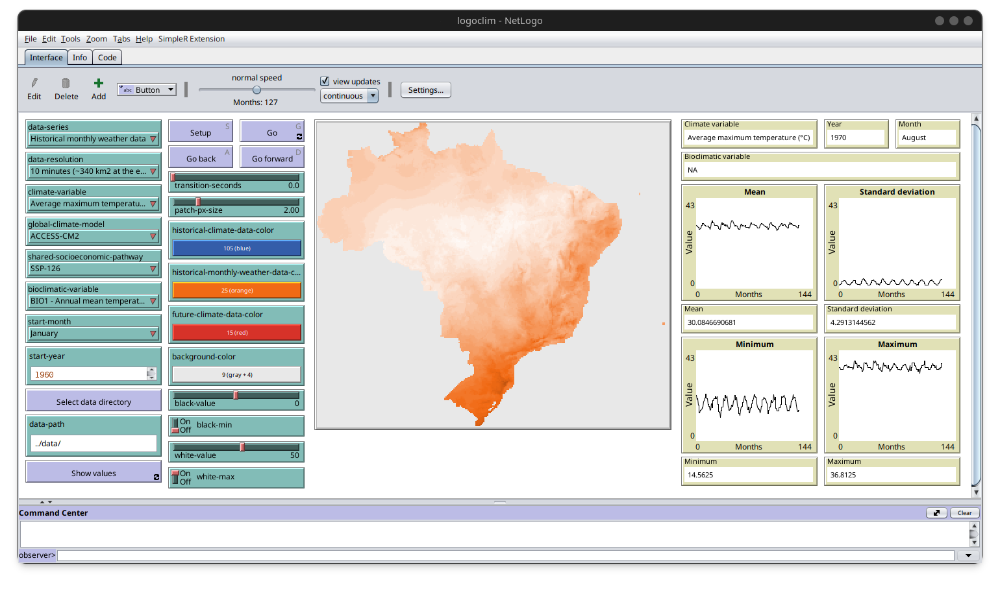

<!-- %:::% paper begin %:::% -->
<!-- The paper should be between 250-1000 words. -->

# Summary

<!-- A summary describing the high-level functionality and purpose of the software for a diverse, non-specialist audience. -->

`LogoClim` is a [NetLogo](https://ccl.northwestern.edu/netlogo/) model designed to simulate and visualize climate conditions, serving as a powerful tool for exploring both historical and projected climate data. Its primary goal is to facilitate the integration of climate data into agent-based models (ABMs) and enhance the reproducibility of these simulations.

The model utilizes raster data to represent climate variables such as temperature and precipitation over time. It incorporates historical data (1960-2021) and future climate projections (2021-2100) derived from global climate models under various Shared Socioeconomic Pathways (SSPs, @oneill2017). All climate inputs are sourced from [WorldClim 2.1](https://worldclim.org/),  which provides high-resolution interpolated datasets derived from weather station records worldwide [@fick2017a].

`LogoClim` follows the FAIR Principles for Research Software (FAIR4RS) [@barker2022] and is openly available on the [CoMSES Network](https://www.comses.net/) and [GitHub](https://github.com/sustentarea/logoclim).

{label="fig-logoclim-interface" width=100%}

# Statement of need

<!-- A Statement of need section that clearly illustrates the research purpose of the software and places it in the context of related work. -->

The lack of reproducibility is a major concern in science [@baker2016], including in computational research [@peng2011]. This challenge is particularly relevant for agent-based models, which are widely used to simulate complex phenomena [@grimm2006a; @grimm2020]. One effective strategy to address this issue is the development of open, specialized tools that enhance transparency, standardization, and reusability among researchers [@ram2019; @barba2022]. This is why `LogoClim` was created.

The `LogoClim` model was developed for seamless integration with other models through NetLogo's LevelSpace (`ls`) extension [@hjorth2020], which enables parallel execution and data exchange between models. This integration capability makes it particularly valuable for agent-based simulations that incorporate climate data to study ecological, environmental, or social processes affected by climate conditions.

<!-- Mention (if applicable) a representative set of past or ongoing research projects using the software and recent scholarly publications enabled by it. -->

The model was created as part of a project of the [Sustentarea](https://www.fsp.usp.br/sustentarea/) Research and Extension Center, which aims to evaluate the impact of climate change on the health and nutrition of Brazilian children under five years old [@carvalho2023a]. `LogoClim` functions as a submodel for an ABM designed to help researchers, policymakers, and practitioners better understand the potential consequences of climate change on this vulnerable population.

# Acknowledgements

<!-- Acknowledgement of any financial support. -->

We gratefully acknowledge the contributions of [Stephen E. Fick](https://orcid.org/0000-0002-3548-6966), [Robert J. Hijmans](https://orcid.org/0000-0001-5872-2872), and the entire [WorldClim](https://worldclim.org/) team for their dedication to developing and maintaining the WorldClim datasets.

We also thank the World Climate Research Programme ([WCRP](https://www.wcrp-climate.org/)), which, through its Working Group on Coupled Modelling, coordinated and promoted the Coupled Model Intercomparison Project Phase 6 ([CMIP6](https://pcmdi.llnl.gov/CMIP6/)).

We acknowledge the climate modeling groups for producing and sharing their outputs; the Earth System Grid Federation ([ESGF](https://esgf.llnl.gov/)) for archiving and facilitating access to the data; and the many funding agencies that support both CMIP6 and ESGF.

Finally, we recognize the [Sustentarea](https://www.fsp.usp.br/sustentarea/) Research and Extension Center at the University of São Paulo ([USP](https://www5.usp.br/)) and the Conselho Nacional de Desenvolvimento Científico e Tecnológico ([CNPq](https://www.gov.br/cnpq/)) for their support in the development of this project.

# Author contributions

The roles below were defined based on the Contributor Roles Taxonomy([CRediT](https://credit.niso.org/)).

[**Daniel Vartanian**](https://orcid.org/0000-0001-7782-759X): Conceptualization, Methodology, Data curation, Software, Validation, Project administration, Writing – Review & editing.

[**Leandro Martin Totaro Garcia**](https://orcid.org/0000-0001-5947-2617): Validation, Writing – Review & editing.

[**Aline Martins de Carvalho**](https://orcid.org/0000-0002-4900-5609): Conceptualization, Funding acquisition, Validation, Project administration, Supervision, Writing – Review & editing.
<!-- %:::% paper end %:::% -->

# References
