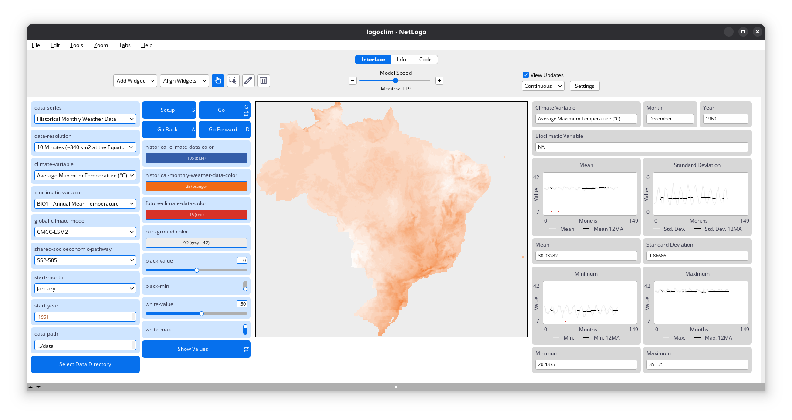

<!-- %:::% paper begin %:::% -->
# Summary

`LogoClim` is a [NetLogo](https://ccl.northwestern.edu/netlogo/) model for simulating and visualizing global climate conditions. It allows researchers to integrate high-resolution climate data into agent-based models, supporting reproducible research in ecology, agriculture, environmental science, and other fields that rely on climate data integration.

The model utilizes raster data to represent climate variables such as temperature and precipitation over time. It incorporates historical data (1951-2024) and future climate projections (2021-2100) derived from global climate models under various Shared Socioeconomic Pathways ([SSPs](https://climatedata.ca/resource/understanding-shared-socio-economic-pathways-ssps/)) [@oneill2017]. All climate inputs come from [WorldClim 2.1](https://worldclim.org/), a widely used source of high-resolution, interpolated climate datasets based on weather station observations worldwide [@fick2017a], available for academic and other non-commercial use.

`LogoClim` follows the FAIR Principles for Research Software ([FAIR4RS](https://fair-software.eu/)) [@barker2022] and is openly available on the [CoMSES Network](https://www.comses.net/codebases/bccd451f-76a4-408a-85fd-c5024359ba9a/) and [GitHub](https://github.com/sustentarea/logoclim). \autoref{fig:logoclim-interface-1} and \autoref{fig:logoclim-interface-2} illustrate the model's interface and functionality.

{width=100%}

# Statement of need

The lack of reproducibility is a major concern in science [@baker2016], including in computational research [@peng2011]. This challenge is particularly relevant for agent-based models, which are used to simulate complex phenomena [@grimm2006a; @grimm2020]. One effective strategy to address this issue is the development of open, specialized tools that enhance transparency and promote standardization, and reusability among researchers [@ram2019; @barba2022]. This is why `LogoClim` was created.

The `LogoClim` model was developed for seamless integration with other models through NetLogo's LevelSpace extension [@hjorth2020], which enables parallel execution and data exchange between models. This integration capability makes it particularly valuable for agent-based simulations that incorporate climate data to study ecological, environmental, or social processes affected by climate conditions.

# Motivation

The model was originally developed as part of a project by the [Sustentarea](https://www.fsp.usp.br/sustentarea/) Research and Extension Center, aimed at evaluating the impact of climate change on the health and nutrition of Brazilian children under five years old [@carvalho2023a]. During development, however, we recognized that the model had broader potential beyond the scope of our study. `LogoClim` can now be used as a submodel within agent-based models designed to help researchers, policymakers, and practitioners explore the potential impacts of climate change across different contexts and geographical areas.

# How it works

`LogoClim` operates on a grid of patches, with each patch representing a geographic area and storing values for latitude, longitude, and selected climate variables. During simulation, patches update their colors based on the underlying data, enabling users to visualize spatial and temporal changes. The model interface also provides plots showing the mean, minimum, maximum, and standard deviation of the selected variable over time.

The model supports all three climate data series from [WorldClim 2.1](https://worldclim.org/): long-term historical climate averages (1970–2000), historical monthly weather (1951–2024), and future climate projections (2021–2100). Each series is available at multiple spatial resolutions (from 10 minutes (~340 km² at the equator) to 30 seconds (~1 km² at the equator)), which can be selected within the model interface. Further details about each series are available on the WorldClim website.

Original datasets can be downloaded directly from [WorldClim 2.1](https://worldclim.org/), but must be converted to ASCII format for use in NetLogo. To streamline this process, we provide [Quarto](https://quarto.org/) notebooks containing reproducible pipelines and all necessary commands to download and process the data. These notebooks can be easily adapted for specific requirements.

For quick testing, example datasets are available in the model's [OSF repository](https://doi.org/10.17605/OSF.IO/RE95Z). These files are pre-converted to ASCII format and ready for use with `LogoClim`. Please note that these datasets are intended for demonstration and testing only, and should not be used for research or analysis.

{width=100%}

# Acknowledgements

We gratefully acknowledge [Stephen E. Fick](https://orcid.org/0000-0002-3548-6966), [Robert J. Hijmans](https://orcid.org/0000-0001-5872-2872), and the entire [WorldClim](https://worldclim.org/) team for their outstanding work in creating and maintaining the WorldClim datasets, which form the foundation of this project.

We thank the [Climatic Research Unit](https://www.uea.ac.uk/groups-and-centres/climatic-research-unit) at the [University of East Anglia](https://www.uea.ac.uk/) and the United Kingdom's [Met Office](https://www.metoffice.gov.uk/) for developing and providing access to the [CRU-TS-4.09](https://crudata.uea.ac.uk/cru/data/hrg/cru_ts_4.09/) dataset, a vital source of historical climate data.

We also acknowledge the World Climate Research Programme ([WCRP](https://www.wcrp-climate.org/)), its Working Group on Coupled Modelling, and the Coupled Model Intercomparison Project Phase 6 ([CMIP6](https://pcmdi.llnl.gov/CMIP6/)) for coordinating and advancing global climate model development.

Finally, we acknowledge the [Sustentarea](https://www.fsp.usp.br/sustentarea/) Research and Extension Center at the University of São Paulo ([USP](https://www5.usp.br/)), the Department of Science and Technology of the Secretariat of Science, Technology, and Innovation and of the Health Economic-Industrial Complex ([SECTICS](https://www.gov.br/saude/pt-br/composicao/sectics)) of the [Ministry of Health](https://www.gov.br/saude/en) of Brazil, and the National Council for Scientific and Technological Development ([CNPq](https://www.gov.br/cnpq/)) (grant no. 444588/2023-0) for their support in the development of this project.

# Author contributions

The roles below were defined based on the Contributor Roles Taxonomy ([CRediT](https://credit.niso.org/)).

[**Daniel Vartanian**](https://orcid.org/0000-0001-7782-759X): Conceptualization, Data curation, Methodology, Project administration, Software, Validation, Writing – Review & editing.

[**Leandro Garcia**](https://orcid.org/0000-0001-5947-2617): Validation, Writing - Review & editing.

[**Aline Martins de Carvalho**](https://orcid.org/0000-0002-4900-5609): Conceptualization, Funding acquisition, Project administration, Supervision, Validation, Writing – Review & editing.

# Additional information

`LogoClim` is an independent project with no affiliation to [WorldClim](https://www.worldclim.org) or its developers. Users should be aware that WorldClim datasets are freely available for academic and other non-commercial use only. Any use of WorldClim data within `LogoClim` must comply with [WorldClim's licensing terms](https://www.worldclim.org/about.html).
<!-- %:::% paper end %:::% -->

# References
